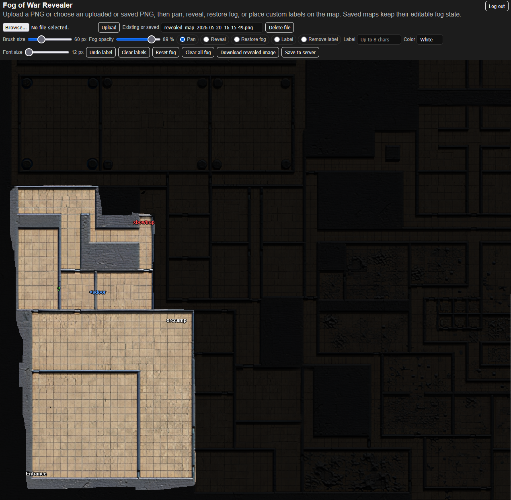

# Fog of War Revealer

A simple browser-based fog-of-war map tool for tabletop RPGs. Upload a PNG map, cover it with fog, reveal areas during play, restore fog when needed, and add short custom labels directly on the map.

## Features

- Password-protected access
- Upload PNG battle maps or dungeon maps
- Select previously uploaded or saved maps
- Delete uploaded and saved map files
- Full-browser map workspace
- iPad-friendly pan mode
- Square reveal brush
- Square restore-fog brush
- Adjustable brush size
- Adjustable fog opacity
- Custom map labels up to 8 characters
- Adjustable label font size
- Label colors: red, green, blue, white, black
- Remove specific labels by clicking them
- Download the revealed map as a PNG
- Save the revealed map to the web server
- Saved maps preserve editable fog and label state

## Requirements

- PHP 8 or newer recommended
- A web server capable of running PHP
- Write permission for the uploads directory

## Installation

1. Copy the PHP file to your web server and name it index.php.

       index.php

2. Create an uploads folder in the same directory as index.php.

       uploads/

3. Make sure the web server can write to the uploads folder.

   On Linux, this may look something like:

       chmod 755 uploads

   Depending on your host, you may also need to set ownership to the web server user.

4. Open index.php in a text editor.

5. Find the password setting near the top of the file.

       $appPassword = "changeme!";

6. Change the password before using the app anywhere public.

       $appPassword = "your-secure-password-here";

7. Upload index.php to your PHP-capable web server.

8. Visit the page in your browser.

       https://your-domain.example/index.php

9. Log in with the password you set.

10. Upload your first PNG map.

## Basic Usage

1. Log in to the app.
2. Upload a PNG map, or select an existing uploaded or saved map.
3. Use Pan mode to move around the map.
4. Use Reveal mode to remove fog from areas the players can see.
5. Use Restore fog mode to cover areas again if too much was revealed.
6. Adjust Brush size to control the reveal and restore-fog square brush.
7. Adjust Fog opacity to make unrevealed areas lighter or darker.
8. Use Label mode to place custom text labels on the map.
9. Enter label text up to 8 characters.
10. Pick a label color: red, green, blue, white, or black.
11. Adjust Font size to change the label size.
12. Use Remove label mode to click and remove a specific label.
13. Use Undo label to remove the most recently placed label.
14. Use Clear labels to remove all labels.
15. Use Download revealed image to save a PNG copy to your computer.
16. Use Save to server to save the current map state on the web server.
17. Reopen saved maps from the Existing or saved dropdown.

## Saved Files

The app saves a rendered PNG and a matching editable state file.

Example saved files:

    revealed_map_2026-05-20_14-30-00.png
    revealed_map_2026-05-20_14-30-00.json

The PNG is the visible rendered map. The JSON stores the editable state, including fog, labels, and the original base map reference.

## File Management

Uploaded base maps use filenames like:

    map_1234567890abcdef.png

Saved revealed maps use filenames like:

    revealed_map_2026-05-20_14-30-00.png

The Delete file button removes selected app-generated map files. The delete logic is restricted to the app's expected filename patterns so it does not delete arbitrary server files.

## Security Notes

This app uses a simple PHP session password gate. It is intended to prevent casual access, not to replace full production authentication.

Before using it publicly:

1. Change the default password.
2. Use HTTPS.
3. Restrict write access to only the required uploads directory.
4. Keep the app in a private or protected server location if possible.
5. Consider adding server-level authentication for stronger protection.

